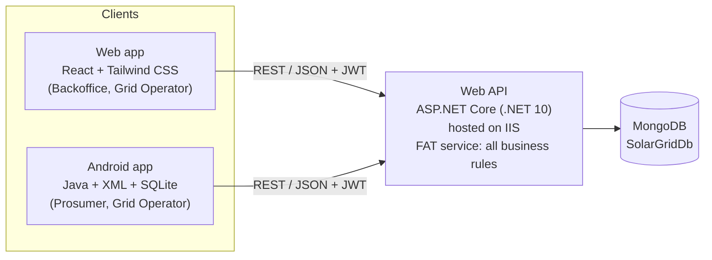
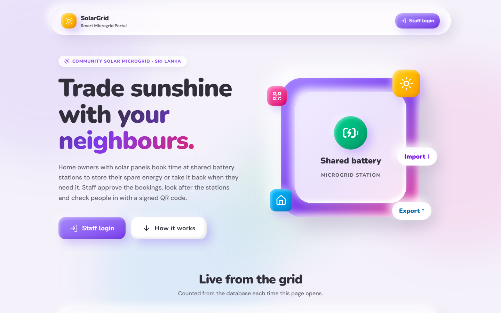
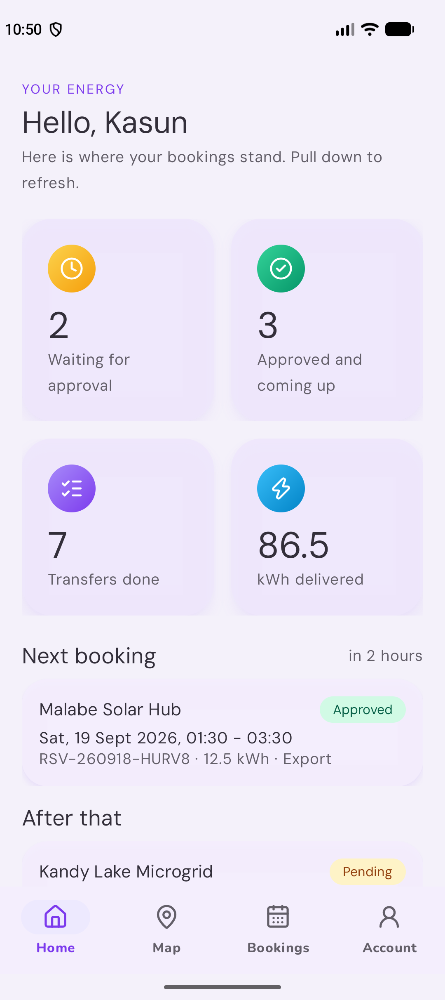

# Smart Solar Microgrid Trading System

**SE4040 – Enterprise Application Development · Assignment 1 · Year 4, Semester 2, 2026**
BSc (Hons) in Information Technology, specialising in Software Engineering

A client–server system for trading solar energy on a community microgrid.

- **Back-office staff** and **grid operators** use a **web application**.
- **Solar prosumers** — home owners with solar panels — use an **Android app** to book time slots for sending surplus
  energy into, or drawing energy from, microgrid battery stations.
- A central **Web API** on IIS holds all business rules and is the only part that talks to the **MongoDB** database.

**Repository:** https://github.com/Ravindu200232/eda-assignment

---

## Architecture



The clients are user interfaces only. Rules such as "bookings must be within 7 days" or "changes need 12 hours'
notice" are enforced by the API, so the web and Android apps always behave the same way.

## Team and contributions

Each member owns one feature from end to end — in the API, the web app and the Android app.

| Member | Feature ownership |
|---|---|
| **Ravindu** | Core platform, authentication, staff user management, operator QR verification, IIS hosting |
| **Malith** | Prosumer accounts (NIC registration, activation, deactivation), dashboards and summaries |
| **Nimthara** | Microgrid stations, battery slots, schedules, maps and nearby search |
| **Hamnad** | Energy reservations, booking workflow and rules, booking history, QR code generation |

### Web API contributions

| Member | Endpoints | Business rules and other work |
|---|---|---|
| **Ravindu** | `auth/*`, `users/*`, `checkin/*`, `health` | Project set-up, MongoDB data layer and indexes, seed data, JWT login and role checks, blocking tokens of deactivated accounts, staff account rules, QR verification with a 2-hour check-in window, transfer completion, error handling, Swagger, IIS hosting scripts |
| **Malith** | `prosumers/*`, `dashboard/*` | NIC registration (pending until activated), profile updates, password-confirmed deactivation, Backoffice-only activation, activation queue, live dashboard numbers (Sri Lanka "today") |
| **Nimthara** | `stations/*`, `slots/*` | Station codes, GPS, capacity and schedule validation, battery slot availability, deactivation blocked by active bookings, nearby search with `$geoNear`, slot creation and weekly generation inside opening hours |
| **Hamnad** | `reservations/*` | 7-day booking window, 12-hour change and cancel notice, atomic bay counter (no overbooking), overlap check, approval and rejection, signed QR codes, current/pending/history lists and search |

### Web app contributions

| Member | Pages | Other work |
|---|---|---|
| **Ravindu** | Login, Staff users, My account, QR check-in (camera, USB scanner or pasted code), not-found and not-allowed pages | Project set-up (Vite, Tailwind CSS, ESLint, Vitest, Playwright), the clay design system and shared components, layouts and menu, API client and session handling, role guards, test helpers and the screenshot run, IIS hosting of the portal |
| **Malith** | Home page, Backoffice dashboard, Operations page, Prosumers (list and details), Pending activations | Live numbers that refresh while visible, waiting sign-ups badge in the menu, "Missed" booking status, prosumer create, edit, deactivate and Backoffice-only activation |
| **Nimthara** | Stations (list and map), New / edit station, Station details | Google Maps with an OpenStreetMap fallback, location chooser, weekly opening hours editor, battery bays, slots per day with add, generate, change and delete, bay shortcut on the Operations page |
| **Hamnad** | Reservations (lists), New / change booking wizard, Booking page | Tabs kept in the address for dashboard links, filters and search, approve / reject / cancel dialogs, 12-hour lock, booking timeline, booking QR code with print and copy |

### Android app contributions

| Member | Screens | Other work |
|---|---|---|
| **Ravindu** | Start-up, Log in, Account, operator Scan and Check-in | Project set-up (Gradle, Java 17, minimum Android 9), the clay theme on Android (fonts, shapes, clay buttons and cards, icons), the Web API client with the token header and the error reader, the SQLite helper and the session table, role routing and session end, the Android 17 local network permission, edge-to-edge screens, the test set-up (Robolectric, stand-in API, Espresso, screenshots, live test script) |
| **Malith** | Sign-up and "waiting for activation", Home dashboard, Profile, Change password, Deactivate | Profile table for offline use, dashboard counts with pull to refresh, form helpers and messages, the password dialog |
| **Nimthara** | Map and station list, Station page, operator Bays | Google Maps with coloured markers and a station card, the phone's location with a Colombo fallback, stations table for offline use, weekly opening hours, slots per day, plural strings |
| **Hamnad** | Bookings (current, waiting, history), Booking form (new and change), Booking page with the QR code, Summary, operator Today | Reservations table for offline use, search, filters and paging, QR drawing with a bright screen, the booking history, the own slot kept when changing, cancelling for a prosumer |

Every source file starts with a header that names its owner.

## Branches

The work is split into 12 member branches (3 parts × 4 members) and 3 integration branches.
Each member's branches have the same name in every part.

| Member | API | Web | Android |
|---|---|---|---|
| Ravindu | `api/ravindu-core-auth-operator` | `web/ravindu-core-auth-operator` | `android/ravindu-core-auth-operator` |
| Malith | `api/malith-prosumers-dashboard` | `web/malith-prosumers-dashboard` | `android/malith-prosumers-dashboard` |
| Nimthara | `api/nimthara-stations-slots-maps` | `web/nimthara-stations-slots-maps` | `android/nimthara-stations-slots-maps` |
| Hamnad | `api/hamnad-reservations-qr` | `web/hamnad-reservations-qr` | `android/hamnad-reservations-qr` |
| **Integration** | `api/integration` | `web/integration` | `android/integration` |

How work reaches `main`:

1. Each member branch is merged into its part's integration branch through a pull request.
   The core branch goes first and reservations go last, because they depend on stations and prosumers.
2. The complete unit and end-to-end test suite runs on the integration branch.
3. When everything passes, the integration branch is merged into `main` through a pull request.

## Folder structure

```
api/        C# Web API solution (src + unit tests + end-to-end tests)
web/        React web application (staff portal for Backoffice and Grid Operators)
android/    Android Studio project (Java + XML + SQLite) for prosumers and Grid Operators
deploy/iis/ Scripts to host the API and the web portal on IIS and check them
docs/       Database design, API endpoints, web pages, Android screens, deployment guide, demo script, screenshots
sources/    Every outside source and library we used, explained in plain English
```

## Running the API

Requirements: .NET 10 SDK and MongoDB running on `localhost:27017`.

```powershell
cd api
dotnet run --project src/SolarGrid.Api
```

Open **http://localhost:5080/swagger**, call `POST /api/auth/login`, press **Authorize** and paste the token.

To host the API on IIS (http://localhost:8080/swagger), see [docs/deployment.md](docs/deployment.md).

### Demo accounts

Created automatically on first start (`App:SeedDemoData`):

| Role | Login (email or NIC) | Password | State |
|---|---|---|---|
| Backoffice | `admin@solargrid.lk` / `198512345678` | `Admin@123` | Active |
| Grid Operator | `operator@solargrid.lk` / `199023456789` | `Operator@123` | Active |
| Prosumer | `kasun@example.com` / `200034501234` | `Prosumer@123` | Active |
| Prosumer | `nadeesha@example.com` / `995671234V` | `Prosumer@123` | Active |
| Prosumer | `tharindu@example.com` / `200112304567` | `Prosumer@123` | Pending activation |
| Prosumer | `dilani@example.com` / `882345678V` | `Prosumer@123` | Deactivated |

The demo data also contains bookings in every status. Booking `RSV-DEMO-0006` is approved and starts within
two hours of the first start-up, so its QR code can be checked in straight away. Delete the `SolarGridDb`
database in MongoDB Compass and restart the API to get fresh demo data.

## Running the web app

Requirements: Node.js 22 or newer and the API running (IIS on port 8080 by default).

```powershell
cd web
npm install
npm run dev
```

Open **http://localhost:5173** and log in with the Backoffice or Grid Operator demo account.
Prosumer accounts are refused on purpose — prosumers use the Android app.
If the API runs somewhere else, copy `web/.env.example` to `web/.env.local` and change `VITE_API_URL`.
An optional Google Maps key in the same file shows Google Maps; without it the maps use OpenStreetMap.
More detail: [web/README.md](web/README.md).

To host the portal on IIS (http://localhost:8081), run `deploy\iis\deploy-web.ps1` as Administrator — see
[docs/deployment.md](docs/deployment.md). Every page and what each role may do is listed in
[docs/web-pages.md](docs/web-pages.md).



## Running the Android app

Requirements: Android Studio (it brings Java and the Android SDK), an emulator or a phone with
Android 9 or newer, and the API running.

```powershell
cd android
copy local.properties.example local.properties
.\gradlew installDebug
```

Open `local.properties` and fill in `sdk.dir`, the Google Maps key and `API_BASE_URL`.
The default address is `http://10.0.2.2:8080/`, which is how an emulator reaches the API on this
computer. For a real phone, use the computer's address on the same Wi-Fi (for example
`http://192.168.1.5:8080/`) and add that host to `app/src/main/res/xml/network_security_config.xml`.
The file is ignored by Git, so no key is ever committed.

Log in with the prosumer or Grid Operator demo account; Backoffice accounts are refused on purpose,
because Backoffice staff work in the web portal. Every screen, its API calls and what each role may do are
listed in [docs/android-app.md](docs/android-app.md); building the APK and the Google Maps key are explained in
[docs/deployment.md](docs/deployment.md#7-the-android-app).



## Tests

```powershell
cd api
dotnet test
```

- **Unit tests** (`api/tests/SolarGrid.Api.UnitTests`) check every business rule with fake repositories and a fake clock.
- **End-to-end tests** (`api/tests/SolarGrid.Api.E2ETests`) start the real API against a temporary MongoDB database,
  call it over HTTP and delete the database afterwards.
- **IIS check:** `deploy\iis\smoke-test.ps1` tests the hosted API.

```powershell
cd web
npm run lint
npm test          # unit tests (Vitest)
npm run e2e       # browser tests (Playwright) against a temporary API and database
```

- **Web unit tests** check the shared components, the session handling and each page with a fake API.
- **Web browser tests** build the web app, start the real API on port 5090 with a temporary MongoDB database,
  click through the portal in Chromium (including a pretend webcam for QR check-in) and delete the database afterwards.
- **Screenshots:** `npm run e2e:screens` saves every page at desktop and phone size to `docs/screenshots/web/`.
- **IIS check:** `deploy\iis\smoke-test-web.ps1` tests the hosted portal and its connection to the API.

```powershell
cd android
.\gradlew lintDebug testDebugUnitTest
.\gradlew connectedDebugAndroidTest "-Pandroid.testInstrumentationRunnerArguments.notAnnotation=lk.sliit.solargrid.live.LiveApi"
```

- **Android unit tests** run on the computer (Robolectric): the SQLite tables, the error reader, the repositories
  against a stand-in server, the booking words, history and slot choices, and the Sri Lankan time formatting.
- **Android emulator tests** (Espresso) sign in as each role, sign up, edit the profile, walk the map and the station
  page, book, change and cancel a slot, show a QR code, walk the operator check-in and Today list, and open every
  screen for the report pictures, also against a stand-in server, so they need no API.
- **Live tests:** `android\scripts\run-e2e.ps1` starts the real API on port 5090 with a temporary MongoDB
  database, runs the tests marked `@LiveApi` on the emulator (sign-in and refusals, a real sign-up, nearby
  stations, booking and cancelling, and the app's QR code passing the operator check) and deletes the database
  afterwards.
- **Screenshots:** `android\scripts\take-screenshots.ps1` saves every app screen to `docs/screenshots/android/`.

## Documentation

- [Database design](docs/database-design.md)
- [API endpoints](docs/api-endpoints.md)
- [Web pages and permissions](docs/web-pages.md)
- [Android screens and permissions](docs/android-app.md)
- [Deployment guide](docs/deployment.md)
- [Demo video script](docs/demo-script.md)
- Screenshots: [web portal](docs/screenshots/web/), [Android app](docs/screenshots/android/)
- [Challenges and how we solved them](docs/challenges.md)
- [Code sources and libraries](sources/README.md)

## Demo video

The video link (under 5 minutes) will be added here before submission.
