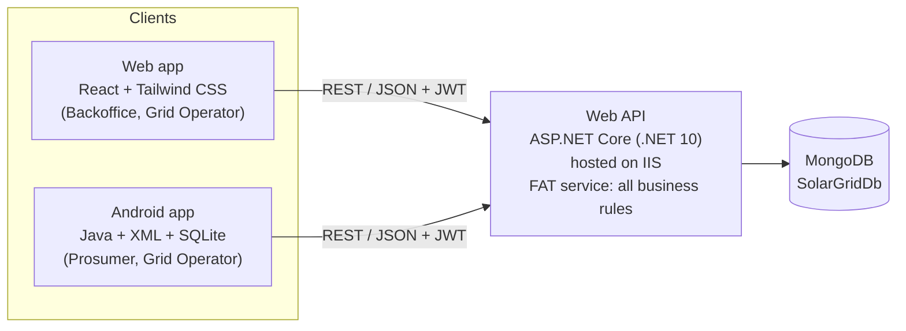

# Smart Solar Microgrid Trading System

**SE4040 – Enterprise Application Development · Assignment 1 · Year 4, Semester 2, 2026**
BSc (Hons) in Information Technology, specialising in Software Engineering

A client–server system for trading solar energy on a community microgrid.

- **Back-office staff** and **grid operators** use a **web application**.
- **Solar prosumers** — home owners with solar panels — use an **Android app** to book time slots for sending surplus
  energy into, or drawing energy from, microgrid battery stations.
- A central **Web API** on IIS holds all business rules and is the only part that talks to the **MongoDB** database.

**Repository:** https://github.com/Ravindu200232/eda-assignment

---

## Architecture



The clients are user interfaces only. Rules such as "bookings must be within 7 days" or "changes need 12 hours'
notice" are enforced by the API, so the web and Android apps always behave the same way.

## Team and contributions

Each member owns one feature from end to end — in the API, the web app and the Android app.

| Member | Feature ownership |
|---|---|
| **Ravindu** | Core platform, authentication, staff user management, operator QR verification, IIS hosting |
| **Malith** | Prosumer accounts (NIC registration, activation, deactivation), dashboards and summaries |
| **Nimthara** | Microgrid stations, battery slots, schedules, maps and nearby search |
| **Hamnad** | Energy reservations, booking workflow and rules, booking history, QR code generation |

A detailed list of who built which endpoint, page and screen is in the report and in each file's header comment.

## Branches

The work is split into 12 branches: 3 parts × 4 members. Each member's branches have the same name in every part.

| Member | API | Web | Android |
|---|---|---|---|
| Ravindu | `api/ravindu-core-auth-operator` | `web/ravindu-core-auth-operator` | `android/ravindu-core-auth-operator` |
| Malith | `api/malith-prosumers-dashboard` | `web/malith-prosumers-dashboard` | `android/malith-prosumers-dashboard` |
| Nimthara | `api/nimthara-stations-slots-maps` | `web/nimthara-stations-slots-maps` | `android/nimthara-stations-slots-maps` |
| Hamnad | `api/hamnad-reservations-qr` | `web/hamnad-reservations-qr` | `android/hamnad-reservations-qr` |

Every branch is merged into `main` through a pull request. Within each part the core branch is merged first, and
reservations are merged last because they depend on stations and prosumers.

## Folder structure

```
api/        C# Web API solution (src + unit tests + end-to-end tests)
web/        React web application            (added in the web phase)
android/    Android Studio project (Java)    (added in the Android phase)
deploy/iis/ Scripts to host the API on IIS and check it
docs/       Database design, API endpoints, deployment guide
sources/    Every outside source and library we used, explained in plain English
```

## Running the API

Requirements: .NET 10 SDK and MongoDB running on `localhost:27017`.

```powershell
cd api
dotnet run --project src/SolarGrid.Api
```

Open **http://localhost:5080/swagger**, call `POST /api/auth/login`, press **Authorize** and paste the token.

To host the API on IIS, see [docs/deployment.md](docs/deployment.md).

### Demo accounts

Created automatically on first start (`App:SeedDemoData`):

| Role | Login (email or NIC) | Password | State |
|---|---|---|---|
| Backoffice | `admin@solargrid.lk` / `198512345678` | `Admin@123` | Active |
| Grid Operator | `operator@solargrid.lk` / `199023456789` | `Operator@123` | Active |
| Prosumer | `kasun@example.com` / `200034501234` | `Prosumer@123` | Active |
| Prosumer | `nadeesha@example.com` / `995671234V` | `Prosumer@123` | Active |
| Prosumer | `tharindu@example.com` / `200112304567` | `Prosumer@123` | Pending activation |
| Prosumer | `dilani@example.com` / `882345678V` | `Prosumer@123` | Deactivated |

## Tests

```powershell
cd api
dotnet test
```

- **Unit tests** (`api/tests/SolarGrid.Api.UnitTests`) check every business rule with fake repositories and a fake clock.
- **End-to-end tests** (`api/tests/SolarGrid.Api.E2ETests`) start the real API against a temporary MongoDB database,
  call it over HTTP and delete the database afterwards.
- **IIS check:** `deploy\iis\smoke-test.ps1` tests the hosted API.

## Documentation

- [Database design](docs/database-design.md)
- [API endpoints](docs/api-endpoints.md)
- [Deployment guide](docs/deployment.md)
- [Code sources and libraries](sources/README.md)

## Demo video

The video link (under 5 minutes) will be added here before submission.
