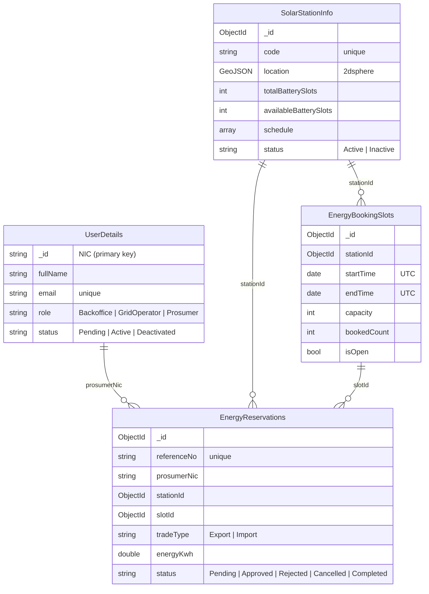
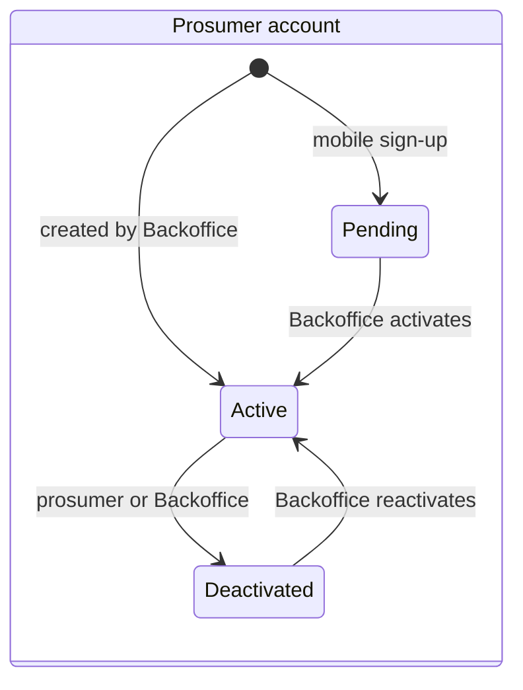
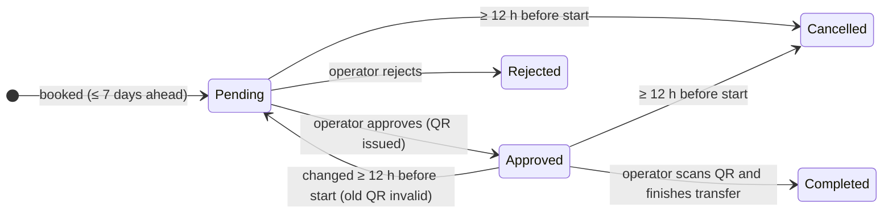

# Database Design (MongoDB and Android SQLite)

**Database:** `SolarGridDb` on MongoDB Community Server 8.3.
Only the Web API reads or writes this database; the web and Android apps go through the API.
The Android app also keeps a small read-only copy on the phone in SQLite, described at the end
([Android SQLite](#android-sqlite)).

The four collections are named after the items in the marking scheme:

| Marking scheme item | Collection | C# model |
|---|---|---|
| User's detail | `UserDetails` | `Models/User.cs` |
| SolarStationInfo | `SolarStationInfo` | `Models/SolarStation.cs` (+ `OperatingHours.cs`) |
| EnergyBookingSlots | `EnergyBookingSlots` | `Models/EnergySlot.cs` |
| Energy Reservation | `EnergyReservations` | `Models/EnergyReservation.cs` |

## Relationships

## Collections

### `UserDetails`

One collection for all people in the system. `role` decides what each user may do.

| Field | Type | Notes |
|---|---|---|
| `_id` | string | **NIC** — old format `853400937V` or new format `198534000937`, stored in upper case |
| `fullName` | string | |
| `email` | string | lower case, **unique** |
| `phone` | string | `07XXXXXXXX` or `+947XXXXXXXX` |
| `passwordHash` | string | BCrypt hash; the real password is never stored |
| `role` | string | `Backoffice`, `GridOperator` or `Prosumer` |
| `status` | string | `Pending` (mobile sign-up), `Active`, `Deactivated` |
| `address`, `meterNumber`, `solarCapacityKw` | string / double | prosumers only |
| `createdAt`, `updatedAt` | date | UTC |
| `activatedBy`, `activatedAt`, `deactivatedAt`, `lastLoginAt` | string / date | audit fields |

Indexes: `_id`, `ux_email` (unique), `ix_role_status`.

### `SolarStationInfo`

A microgrid node (solar hub with battery storage).

| Field | Type | Notes |
|---|---|---|
| `_id` | ObjectId | |
| `code` | string | e.g. `SSG-MAL-01`, **unique** |
| `name`, `address` | string | |
| `location` | GeoJSON Point | `{ type: "Point", coordinates: [longitude, latitude] }` |
| `solarCapacityKw` | double | generation capacity (kW) |
| `storageCapacityKwh` | double | total battery storage (kWh) |
| `totalBatterySlots` | int | physical battery bays |
| `availableBatterySlots` | int | bays currently usable (updated by Grid Operators) |
| `schedule` | array | one entry per weekday: `{ day, openTime, closeTime }`, local time `HH:mm`, `24:00` = midnight |
| `status` | string | `Active` or `Inactive` |
| `createdAt`, `updatedAt` | date | |

Indexes: `_id`, `ux_code` (unique), `ix_location_2dsphere` (for "nearby stations"), `ix_status`.

### `EnergyBookingSlots`

A bookable time window at a station.

| Field | Type | Notes |
|---|---|---|
| `_id` | ObjectId | |
| `stationId` | ObjectId | → `SolarStationInfo._id` |
| `startTime`, `endTime` | date | UTC |
| `capacity` | int | bays that can be booked in this window |
| `bookedCount` | int | bays held by Pending, Approved or Completed reservations |
| `isOpen` | bool | operators can close a slot |
| `createdAt`, `updatedAt` | date | |

Indexes: `_id`, `ux_station_start` (unique: one slot per station per start time).

### `EnergyReservations`

A prosumer's booking of one bay in a slot.

| Field | Type | Notes |
|---|---|---|
| `_id` | ObjectId | |
| `referenceNo` | string | shown to users, **unique** |
| `prosumerNic`, `prosumerName` | string | → `UserDetails._id` (name copied for fast lists) |
| `stationId`, `stationName` | ObjectId / string | → `SolarStationInfo._id` (name copied) |
| `slotId` | ObjectId | → `EnergyBookingSlots._id` |
| `startTime`, `endTime` | date | copied from the slot so date filters need no join |
| `tradeType` | string | `Export` (send surplus solar into the battery) or `Import` (draw stored energy) |
| `energyKwh` | double | requested amount |
| `deliveredKwh` | double | recorded by the operator when completed |
| `status` | string | `Pending`, `Approved`, `Rejected`, `Cancelled`, `Completed` |
| `qrNonce` | string | random value inside the QR code; replaced when a booking changes |
| `reason` | string | why it was rejected or cancelled |
| `createdBy`, `approvedBy`, `rejectedBy`, `cancelledBy`, `completedBy` | string | NIC of the person who acted |
| `createdAt`, `updatedAt`, `approvedAt`, `rejectedAt`, `cancelledAt`, `completedAt` | date | |

Indexes: `_id`, `ux_reference` (unique), `ix_prosumer_start`, `ix_station_status`, `ix_status_start`, `ix_slot`.

## Status lifecycles

## Design decisions

1. **NIC as the document id.** The assignment makes NIC the primary key, so `_id` holds the NIC and MongoDB enforces uniqueness for free.
2. **One user collection for all roles.** Staff and prosumers share login, password and status logic; a `role` field separates them.
3. **Copied names in reservations.** Station and prosumer names are stored inside each reservation. Lists load with one query, which is a normal NoSQL trade-off. The ids are kept, so the full records are always reachable.
4. **GeoJSON + 2dsphere index.** Lets MongoDB answer "stations near me" and return the distance directly.
5. **Booked-bay counter on each slot.** `bookedCount` is changed with a single atomic update that checks capacity, so two people cannot take the last bay. The local MongoDB runs as a single server (no replica set), so multi-document transactions are not available; changes that touch two slots are undone step by step if the second step fails.
6. **Times in UTC.** All dates are stored in UTC. Rules such as "today" use Sri Lanka time (`Asia/Colombo`, UTC+05:30) through `AppClock`.
7. **Readable documents.** Field names are camelCase, enums are stored as words and empty fields are not written, so data is easy to inspect in MongoDB Compass.

## Sample data

When `App:SeedDemoData` is `true` and the database has no stations, the API adds:

| Collection | Sample data |
|---|---|
| `UserDetails` | 1 Backoffice admin, 1 Grid Operator, 4 prosumers (2 active, 1 pending, 1 deactivated) |
| `SolarStationInfo` | 5 stations: Malabe (24 h), Colombo Fort, Kandy, Galle Fort, Negombo (inactive) |
| `EnergyBookingSlots` | 2-hour slots from yesterday to 6 days ahead for the active stations |
| `EnergyReservations` | 6 bookings covering every status |

Log-in details are listed in the main [README](../README.md#demo-accounts).

## Android SQLite

The Android app keeps a small copy of data on the phone in SQLite (`solargrid.db`, opened by
`android/app/src/main/java/lk/sliit/solargrid/data/local/SolarGridDbHelper.java`). It is only a cache: the Web API and
MongoDB stay the one source of truth, every change goes through the API first, and a copy on the phone never allows a
change on its own. Each member added the table of their feature, which is why the database version counts up.

| Table | Version | Key | Main columns | What it is for | Owner |
|---|---|---|---|---|---|
| `session` | 1 | `id` (always 1) | `token`, `expires_at`, `nic`, `full_name`, `email`, `phone`, `role`, `status`, `saved_at` | Login details, so the app signs the user in again until the token expires | Ravindu |
| `profile` | 2 | `nic` | `full_name`, `email`, `phone`, `address`, `meter_number`, `solar_kw`, `status`, `updated_at` | The prosumer's own profile when offline | Malith |
| `stations` | 3 | `id` | `code`, `name`, `address`, `lat`, `lng`, `solar_kw`, `storage_kwh`, `total_bays`, `free_bays`, `bay_kwh`, `schedule_json`, `status`, `distance_km`, `cached_at` | Reference data for the map, the station list and the station page | Nimthara |
| `reservations` | 4 | `id` | `reference_no`, `prosumer_nic`, `prosumer_name`, `station_id`, `station_name`, `slot_id`, `start_utc`, `end_utc`, `trade_type`, `energy_kwh`, `delivered_kwh`, `status`, `reason`, `can_modify`, `modify_deadline`, `is_past`, `has_qr`, `created_by`, `created_at`, `approved_at`, `rejected_at`, `cancelled_by`, `cancelled_at`, `completed_at`, `cached_at` | The last bookings seen, for the lists and the booking page when offline | Hamnad |

- **Logging out** clears `session`, `profile` and `reservations`. `stations` stays, because it holds the same public
  data for every user.
- **Times** are stored as the UTC text the API sends and shown in Sri Lanka time.
- **Offline rules:** a saved booking is read with `can_modify` off, and its slot counts as past once its end time has
  gone by, even if it was saved earlier. Slots are never saved, because a booking needs the free bays of right now.
